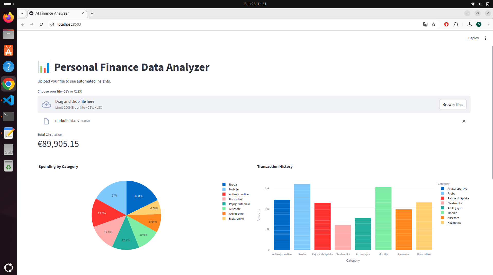

# 💰 AI Finance Data Analyzer

A professional, interactive web application built with **Python** and **Streamlit** to analyze and visualize financial data from CSV and Excel exports.

## 📊 Project Preview


## 🚀 Key Features
* **Smart Data Loading**: Automatically detects and handles different file encodings (UTF-8 and Latin-1).
* **Bilingual Support**: Specifically designed to map Albanian financial terms (like `Kategoria` and `Qarkullimi`) to standard data models.
* **Real-time Metrics**: Instantly calculates total circulation and summary statistics from uploaded files.
* **Interactive Visualizations**: Features dynamic Pie Charts and Bar Charts using Plotly for deep-dive expense analysis.

## 🛠️ Technology Stack
* **Python 3.12**: The core programming language.
* **Streamlit**: For building the modern web interface.
* **Pandas**: Used for high-performance data manipulation and cleaning.
* **Plotly**: For creating interactive, publication-quality graphs.

## 📦 How to Run
1. Clone the repository:
```bash
git clone [https://github.com/halilidrilon52-debug/personal-finance-analyzer.git](https://github.com/halilidrilon52-debug/personal-finance-analyzer.git)


